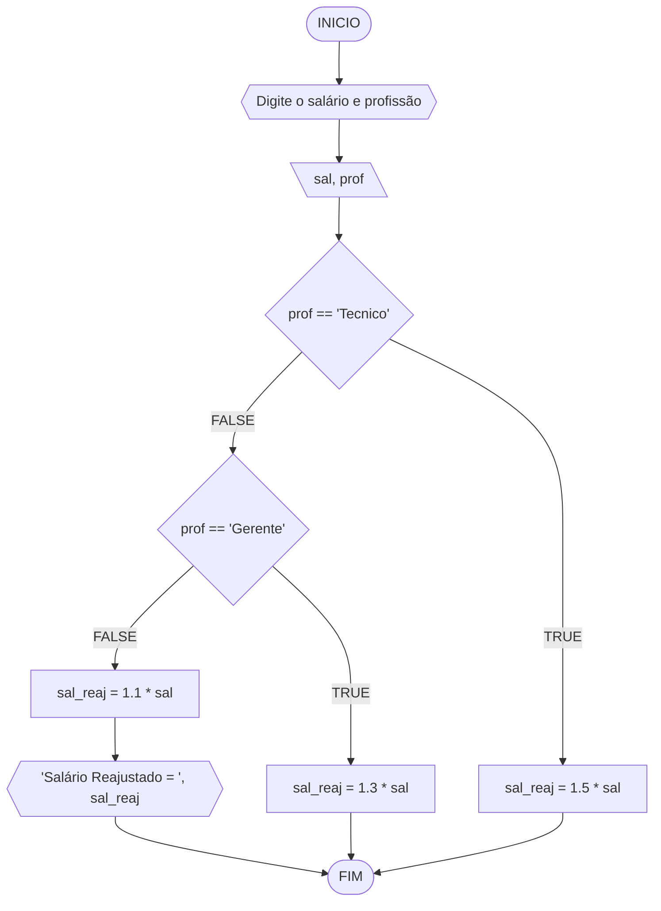
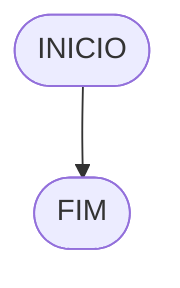

# UNIFOR
**Nome**: Arthur Alexandre Alves <br>
**Disciplina**: Raciocínio lógico algorítmico

## Exercício exemplo
Represente, em fluxograma e pseudocódigo, um algoritmo para calcular o adicional de salário de funcionário por cargo de uma empresa fictícia. Sabe-se que os funcionários de cargo técnico receberão reajuste de 50%, cargo de gerência, um reajuste de 30% e demais, um reajuste de 10%. 

#### Fluxograma


#### Pseudocódigo
```
1  ALGORITMO calReajuste
2  DECLARE  sal, sal_reaj: real, prof: caractere
3  INICIO
4  LEIA sal, prof
5  ESCOLHA
6   CASO prof == “Técnico”		// caso 1
7     sal_reaj ← 1.5 * sal
8   CASO prof = “Gerente”		// caso 2
9     sal_reaj ← 1.3 * sal
10  SENÃO
11    sal_reaj ← 1.1 * sal
12 FIM_ESCOLHA
13 ESCREVA “Salário Reajustado = “, sal_reaj
14 FIM
```

#### Teste
| sal | prof | prof == “Técnico” | prof = “Gerente” | sal_reaj | Saída |
| -- | -- | -- | -- | -- | -- |
| 1000 | Técnico | V | F | 1500 | “Salário Reajustado = 1500“ |
| 2000 | Gerente | F | V | 2600 | “Salário Reajustado = 2600“ |
| 9000 | Diretor | F | F | 9900 | “Salário Reajustado = 9900“ |

## Lista de exercícios 02

### Exercício 01 (2.5 pontos)
Calcule a média de quatro números inteiros dados.

#### Fluxograma (1.0 ponto)


#### Pseudocódigo (1.0 ponto)

```
Algoritmo Media
DECLARE n1, n2, n3, n4, media INTEIRO E POSITIVO
  ESCREVA "Digite o primeiro número: "
  LEIA n1
  ESCREVA "Digite o segundo número: "
  LEIA n2
  ESCREVA "Digite o terceiro número: "
  LEIA n3
  ESCREVA "Digite o quarto número: "
 LEIA n4
ENTÃO FAÇA  media = (n1 + n2 + n3 + n4) / 4
 ESCREVA "A média dos quatro números é: " media
FIM_ALGORITMO
```

#### Teste de mesa (0.5 ponto)

| nome_coluna1 | nome_coluna2 | nome_coluna3 | nome_coluna4 | nome_coluna5 | 
|      --      |      --      |      --      |      --      |      --      | 
| Adicione     | espaço       | se quiser    |  alinhar     | as barras    |
| verticais,   | mas          | não é        | obrigatório. | Entendido ?  |

### Exercício 02 (2.5 pontos)
Leia uma temperatura dada em Celsius (C) e imprima o equivalente em Fahrenheit (F). (Fórmula de conversão: F = (9/5) * C + 32)

#### Fluxograma (1.0 ponto)



#### Pseudocódigo (1.0 ponto)

```
Algoritmo ConverteCelsiusFarenheit
DECLARE  temperaturaC, temperaturaF NUMÉRICO  
  ESCREVA "Digite a temperatura em Celsius (C): " 
  LEIA  temperaturaC  
 ENTÃO FAÇA temperaturaF = (9 / 5) * temperaturaC + 32  
  ESCREVA "A  temperatura  equivalente  em  Fahrenheit (F) é: " temperaturaF
FIM_ALGORITMO
```

#### Teste de mesa (0.5 ponto)

| nome_coluna1 | nome_coluna2 | nome_coluna3 | nome_coluna4 | nome_coluna5 | 
|      --      |      --      |      --      |      --      |      --      | 
| Adicione     | espaço       | se quiser    |  alinhar     | as barras    |
| verticais,   | mas          | não é        | obrigatório. | Entendido ?  |

### Exercício 03 (2.5 pontos)
Receba dois números reais e um operador e efetue a operação correspondente com os valores recebidos (operandos). 
O algoritmo deve retornar o resultado da operação selecionada simulando todas as operações de uma calculadora simples.

#### Fluxograma (1.0 ponto)


#### Pseudocódigo (1.0 ponto)

```
Algoritmo Calculadora
DECLARE num1, num2, resultado NUMÉRICO
DECLARE operador CARACTERE
ESCREVA "Digite o primeiro número: "
LEIA num1
ESCREVA "Digite o segundo número: "
LEIA num2
ESCREVA "Digite o operador: "
LEIA operador
SE operador == “+” ENTÃO
resultado = num1 + num2
SENÃO
SE operador == “-” ENTÃO
resultado = num1 - num2
SENÃO
SE operador == ‘*’ ENTÃO
resultado = num1 * num2
SENÃO
SE operador == “/” ENTÃO
SE num2 != 0 ENTÃO
resultado = num1 / num2
SENÃO
ESCREVA “Erro: Divisão por zero!”
FIM_SE
SENÃO
ESCREVA “Operador inválido!”
FIM_SE
ESCREVA "Resultado: " resultado
FIM_ALGORITMO
```

#### Teste de mesa (0.5 ponto)

| nome_coluna1 | nome_coluna2 | nome_coluna3 | nome_coluna4 | nome_coluna5 | 
|      --      |      --      |      --      |      --      |      --      | 
| Adicione     | espaço       | se quiser    |  alinhar     | as barras    |
| verticais,   | mas          | não é        | obrigatório. | Entendido ?  |

### Exercício 04 (2.5 pontos)
Elaborar um algoritmo que, dada a idade, classifique nas categorias: infantil A (5 - 7 anos), infantil B (8 -10 anos), juvenil A (11 - 13 anos), juvenil B (14 -17 anos) e adulto (maiores que 18 anos).

#### Fluxograma (1.0 ponto)


#### Pseudocódigo (1.0 ponto)

```
Algoritmo ClassificaCategoria
DECLARE idade INTEIRO
ESCREVA "Digite a idade: "
LEIA idade 5
SE idade >= E idade <= 7 ENTÃO
ESCREVA “Categoria: Infantil A”
SENÃO SE idade >= 8 E idade <= 10 ENTÃO
ESCREVA “Categoria: Infantil B”
SENÃO SE idade >= 11 E idade <= 13 ENTÃO
ESCREVA “Categoria: Juvenil A”
SENÃO SE idade >= 14 E idade <= 17 ENTÃO
ESCREVA “Categoria: Juvenil B”
SENÃO SE idade >= 18 ENTÃO
ESCREVA “Categoria: Adulto”
SENÃO
ESCREVA “Idade inválida”
FIM_SE
FIM_ALGORITMO
```

#### Teste de mesa (0.5 ponto)

| nome_coluna1 | nome_coluna2 | nome_coluna3 | nome_coluna4 | nome_coluna5 | 
|      --      |      --      |      --      |      --      |      --      | 
| Adicione     | espaço       | se quiser    |  alinhar     | as barras    |
| verticais,   | mas          | não é        | obrigatório. | Entendido ?  |
